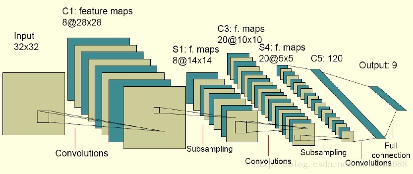

# 卷积神经网络

> 维基百科介绍 https://zh.wikipedia.org/wiki/%E5%8D%B7%E7%A7%AF%E7%A5%9E%E7%BB%8F%E7%BD%91%E7%BB%9C

这篇例子是学习 [莫烦PYTHON](https://morvanzhou.github.io/tutorials/machine-learning/tensorflow/) 视频教程整理的学习笔记。

卷积神经网络包含如下几层：

1. 输入层
2. 卷积层（卷积层的结构 + 向前传播算法） =>> （过滤器或内核）（用来提取特征,每一层会将图层变厚）
3. 池化层（用来采样，稀疏参数，每一层会将图层变瘦）
4. 全连接层（将前两层提取的图像特征使用全连接层完成分类任务）
5. Softmax 层（主要处理分类，得到不同种类的概率分布情况）



首先我们将如下包导入，这次练习是通过 Tensorflow 提供的 MNIST 数据集进行训练，识别手写数字。


```python
import tensorflow as tf
import numpy as np
from tensorflow.examples.tutorials.mnist import input_data

# 下载或加载数据
mnist = input_data.read_data_sets("MNIST_data", one_hot=True)
```

    Extracting MNIST_data/train-images-idx3-ubyte.gz
    Extracting MNIST_data/train-labels-idx1-ubyte.gz
    Extracting MNIST_data/t10k-images-idx3-ubyte.gz
    Extracting MNIST_data/t10k-labels-idx1-ubyte.gz


```python
def weight_variable(shape):
    inital = tf.truncated_normal(shape, stddev=0.1)
    return tf.Variable(inital)


def bias_variable(shape):
    inital = tf.constant(0.1, shape=shape)
    return tf.Variable(inital)

def add_layer(inputs, in_size, out_size, activation_function=None):
    # 在生成初始参数时，随机变量(normal distribution)会比全部为0要好很多
    # 所以我们这里的weights为一个in_size行, out_size列的随机变量矩阵。
    weights = tf.Variable(tf.random_normal([in_size, out_size]))
    # biases的推荐值不为0，所以我们这里是在0向量的基础上又加了0.1
    biases = tf.Variable(tf.zeros([1, out_size]) + 0.1)
    wx_plus_b = tf.matmul(inputs, weights) + biases
    if activation_function is None:
        outputs = wx_plus_b
    else:
        outputs = activation_function(wx_plus_b)
    return outputs

def compute_accuracy(v_xs, v_ys):
    global prediction
    y_pre = sess.run(prediction, feed_dict={xs: v_xs, keep_drop: 1})
    correct_prediction = tf.equal(tf.argmax(y_pre,1), tf.argmax(v_ys,1))
    accuracy = tf.reduce_mean(tf.cast(correct_prediction, tf.float32))
    result = sess.run(accuracy, feed_dict={xs: v_xs, ys: v_ys, keep_drop: 1})
    return result

def conv2d(x, w):
    # stride [1, x_movement, y_movement, 1]
    # Must have strides[0] = strides[4] = 1
    return tf.nn.conv2d(x, w, strides=[1,1,1,1], padding='SAME')

def max_pool_2x2(x):
    # stride [1, x_movement, y_movement, 1]
    return tf.nn.max_pool(x, ksize=[1,2,2,1], strides=[1,2,2,1], padding='SAME')

xs = tf.placeholder(tf.float32, [None, 784])  # 28 * 28
ys = tf.placeholder(tf.float32, [None, 10])
keep_drop = tf.placeholder(tf.float32)
x_image = tf.reshape(xs, [-1, 28, 28, 1])
# print x_image.shape  # [n_sample, 28, 28, 1]

# conv1 layer #
w_conv1 = weight_variable([5,5,1,32])  # patch 5 x 5, in size 1, out size 32
b_conv1 = bias_variable([32])
h_conv1 = tf.nn.relu(conv2d(x_image, w_conv1) + b_conv1)  # output size 28 x 28 x 32
h_pool1 = max_pool_2x2(h_conv1)  # output size 14 x 14 x 32

# conv2 layer #
w_conv2 = weight_variable([5,5,32,64])  # patch 5 x 5, in size 32, out size 64
b_conv2 = bias_variable([64])
h_conv2 = tf.nn.relu(conv2d(h_pool1, w_conv2) + b_conv2)  # output size 14 x 14 x 64
h_pool2 = max_pool_2x2(h_conv2)  # output size 7 x 7 x 64

# func1 layer #
w_fc1 = weight_variable([7 * 7 * 64, 1024])
b_fc1 = bias_variable([1024])
h_pool2_flat = tf.reshape(h_pool2, [-1, 7*7*64])  # [n_sample, 7, 7 64]  -> [n_sample, 7*7*64]
h_fc1 = tf.nn.relu(tf.matmul(h_pool2_flat, w_fc1) + b_fc1)
h_fc1_drop = tf.nn.dropout(h_fc1, keep_drop)

# func2 layer #
w_fc2 = weight_variable([1024, 10])
b_fc2 = bias_variable([10])
```

通过使用 `softmax` 分类器输出分类


```python
prediction = tf.nn.softmax(tf.matmul(h_fc1_drop, w_fc2) + b_fc2)
```

loss函数（即最优化目标函数）选用交叉熵函数。交叉熵用来衡量预测值和真实值的相似程度，如果完全相同，它们的交叉熵等于零。


```python
cross_entropy = tf.reduce_mean(-tf.reduce_sum(ys * tf.log(prediction), reduction_indices=[1]))
```

通过使用 `AdamOptimizer` 优化器进行优化，使 `cross_entropy` 最小


```python
train_step = tf.train.AdamOptimizer(1e-4).minimize(cross_entropy)
```

下面开始训练，通过两千次的训练，每次抽样 100 条数据，每 100 次训练完验证一下预测的准确率


```python
with tf.Session() as sess:
    sess.run(tf.global_variables_initializer())

    for i in range(1, 2001):
        batch_xs, batch_ys = mnist.train.next_batch(100)
        sess.run(train_step, feed_dict={xs: batch_xs, ys: batch_ys, keep_drop: 0.5})
        if i % 100 == 0:
            print i, compute_accuracy(
                mnist.test.images[:1000], mnist.test.labels[:1000])

print "end!"
```

    100 0.861
    200 0.904
    300 0.93
    400 0.933
    500 0.94
    600 0.949
    700 0.955
    800 0.958
    900 0.961
    1000 0.964
    1100 0.966
    1200 0.968
    1300 0.972
    1400 0.968
    1500 0.973
    1600 0.972
    1700 0.976
    1800 0.975
    1900 0.973
    2000 0.981
    end!


```python

```
